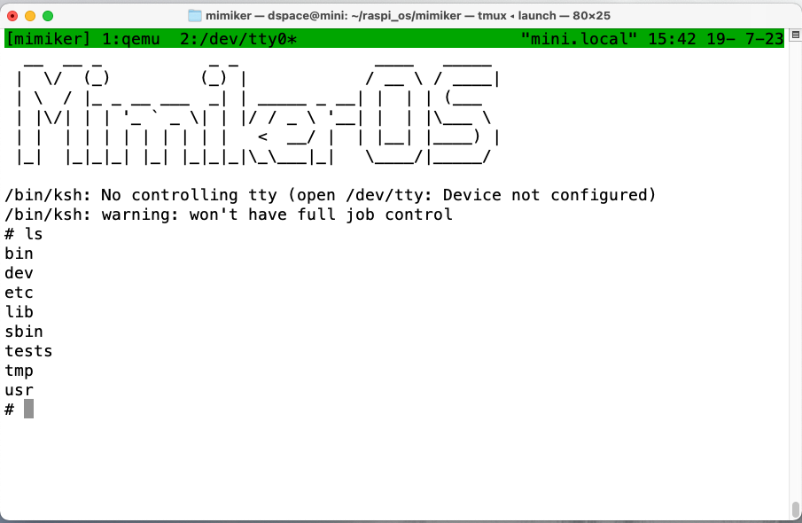

# インストール

## 1回目: 何も実行されない

```bash
$ make BOARD=rpi3 CLANG=1 VERBOSE=1
/Users/dspace/raspi_os/mimiker/build/tools.mk:23: *** clang compiler not found - please refer to README.md!.  Stop.
```

- clangのバージョンが違っていた
- Makefileではv14が指定されていたが、手元のclangはv16だった

```
$ clang --version
Homebrew clang version 16.0.2
Target: x86_64-apple-darwin20.6.0
Thread model: posix
InstalledDir: /usr/local/opt/llvm/bin
```

```diff
$ git diff build/tools.mk
diff --git a/build/tools.mk b/build/tools.mk
index e935f77c..dd1a8bb3 100644
--- a/build/tools.mk
+++ b/build/tools.mk
@@ -6,7 +6,7 @@
 # The following make variables are set by the including makefile:
 # - TARGET, ABIFLAGS: Set by arch.*.mk files.

-LLVM_VER := -14
+LLVM_VER :=

 ifeq ($(shell which ccache > /dev/null; echo $$?), 0)
   CCACHE := ccache
```

## 2回目: エラー発生

```
$ make BOARD=rpi3 CLANG=1 VERBOSE=1
/Applications/Xcode.app/Contents/Developer/usr/bin/make -C include setup
[SYMLINK] machine -> aarch64
rm -f machine
ln -s aarch64 machine
[MAKE] download sys
...
/Users/dspace/raspi_os/mimiker/lib/libterminfo/hash.c:94:1: error: a function definition without a prototype is deprecated in all versions of C and is not supported in C2x [-Werror,-Wdeprecated-non-prototype]
_ti_flaghash (str, len)
^
...
6 errors generated.
make[2]: *** [hash.o] Error 1
make[1]: *** [libterminfo-build] Error 2
make: *** [lib-build] Error 2
```

### `hash.c`の関数の書き方が古い

- `hash.c`は`hashgen`シェルスクリプトが`include/term.h`から作成
- 生成された関数がK&R形式になっている

```c
tatic unsigned int
_ti_flaghash (str, len)
     register const char *str;
     register unsigned int len;
{}
```

#### 対応1: 変わらず

- 必須のpythonモジュールが未インストールだったのでインストール

```bash
$ pip3 install -r requirements.txt
```

#### 対応2: エラーが変わる

- genhashスクリプト中のgperfに`--language=ANSI-C`オプションを指定

```diff
$ git diff lib/libterminfo/genhash
diff --git a/lib/libterminfo/genhash b/lib/libterminfo/genhash
index d5c8b821..27a16fbf 100644
--- a/lib/libterminfo/genhash
+++ b/lib/libterminfo/genhash
@@ -57,7 +57,8 @@ genent()
   sed -e "1,/enum TI${NAME}/d" -e '/};/,$d' \
       -e 's/.*TICODE_\([^,]*\).*/\1/' $TERMH | \
       awk "BEGIN {print \"$STRUCT_DECL\n%%\"} {print \$0 \", \" NR-1}" | \
-      gperf --compare-strncmp --hash-function-name=_ti_${name}hash \
+      gperf --language=ANSI-C \
+            --compare-strncmp --hash-function-name=_ti_${name}hash \
             --lookup-function-name=_ti_${name}lookup --enum \
             --struct-type --omit-struct-type --initializer-suffix=", 0"
```

```c
static unsigned int
_ti_flaghash (register const char *str, register unsigned int len)
{}
```

```bash
/Users/dspace/raspi_os/mimiker/lib/libterminfo/termcap_hash.c:49:1: error: a function definition without a prototype is deprecated in all versions of C and is not supported in C2x [-Werror,-Wdeprecated-non-prototype]
_t_flaghash (str, len)
```

#### 対応3: エラーが変わる

- `termcap_hash.c`は`genthash`で作成されていた

```diff
$ git diff lib/libterminfo/genthash
diff --git a/lib/libterminfo/genthash b/lib/libterminfo/genthash
index ab02b870..7f654f24 100644
--- a/lib/libterminfo/genthash
+++ b/lib/libterminfo/genthash
@@ -45,15 +45,15 @@ EOF

 sed -n -e "1,/_ti_cap_flagids/d" -e '/};/,$d' \
     -e 's/.*"\([^"]*\)".*/"\1"/p' $TERMCAPC | \
-    gperf --compare-strncmp --hash-function-name=_t_flaghash \
+    gperf --language=ANSI-C --compare-strncmp --hash-function-name=_t_flaghash \
           --lookup-function-name=__unused1 --enum
 echo
 sed -n -e "1,/_ti_cap_numids/d" -e '/};/,$d' \
     -e 's/.*"\([^"]*\)".*/"\1"/p' $TERMCAPC | \
-    gperf --compare-strncmp --hash-function-name=_t_numhash \
+    gperf --language=ANSI-C --compare-strncmp --hash-function-name=_t_numhash \
           --lookup-function-name=__unused2 --enum
 echo
 sed -n -e "1,/_ti_cap_strids/d" -e '/};/,$d' \
     -e 's/.*"\([^"]*\)".*/"\1"/p' $TERMCAPC | \
-    gperf --compare-strncmp --hash-function-name=_t_strhash \
+    gperf --language=ANSI-C --compare-strncmp --hash-function-name=_t_strhash \
           --lookup-function-name=__unused3 --enum
```

```bash
[MAKE] build lib/libutil
/Applications/Xcode.app/Contents/Developer/usr/bin/make -C libutil build
[YACC]  -> lib/libutil/parsedate.c
byacc -o parsedate.c /Users/dspace/raspi_os/mimiker/lib/libutil/parsedate.y
make[2]: byacc: No such file or directory
```

#### 対応4: 別のエラー発生

- byaccをインストール

```bash
$ brew install byacc
```

```bash
parsedate.c:1398:14: error: variable 'yynerrs' set but not used [-Werror,-Wunused-but-set-variable]
    int      yynerrs;
             ^
1 error generated.
```

#### 対応5: 別のエラー発生

- `lib/libutil/parsedate.c`に3箇所あるyynerrsをコメントアウト

```bash
[MAKE] install lib/csu
/Applications/Xcode.app/Contents/Developer/usr/bin/make -C csu install
[INSTALL] lib/csu/crt0-common.o -> /lib/crt0-common.o
install -D -m 644 crt0-common.o /Users/dspace/raspi_os/mimiker/sysroot/lib/crt0-common.o
install: illegal option -- D
usage: install [-bCcpSsv] [-B suffix] [-f flags] [-g group] [-m mode]
               [-o owner] file1 file2
       install [-bCcpSsv] [-B suffix] [-f flags] [-g group] [-m mode]
               [-o owner] file1 ... fileN directory
       install -d [-v] [-g group] [-m mode] [-o owner] directory ...
```

#### 対応6: 別のエラーが発生

- `-D`オプションはMacのinstallにはないが、BSD系installやginstallにはあった。
- ginstallを使用するように`build/tools.mk`を変更

```bash
/Users/dspace/raspi_os/mimiker/bin/ksh/c_ksh.c:13:1: error: a function definition without a prototype is deprecated in all versions of C and is not supported in C2x [-Werror,-Wdeprecated-non-prototype]
c_cd(wp)
```

#### 対応7: 別のエラー発生

- bin/kshディレクトリのすべてのC関数はK&R形式で書かれていた（他のアプリはANSI-C）
- ANSI-C形式に変換した
- `cproto -a -i -s emacs.c`のように`cproto`コマンドをすべてのcファイルに対して実行した。

```bash
/Users/dspace/raspi_os/mimiker/contrib/sbase/sbase/kill.c:21:68: error: use of undeclared identifier 'SIGURG'
        SIG(TERM), SIG(TSTP), SIG(TTIN), SIG(TTOU), SIG(USR1), SIG(USR2), SIG(URG),
                                                                          ^
/Users/dspace/raspi_os/mimiker/contrib/sbase/sbase/kill.c:18:22: note: expanded from macro 'SIG'
#define SIG(n) { #n, SIG##n }
                     ^
<scratch space>:127:1: note: expanded from here
SIGURG
^
/Users/dspace/raspi_os/mimiker/contrib/sbase/sbase/kill.c:30:18: error: invalid application of 'sizeof' to an incomplete type 'struct (unnamed struct at /Users/dspace/raspi_os/mimiker/contrib/sbase/sbase/kill.c:13:1)[]'
        for (i = 0; i < LEN(sigs); i++)
                        ^~~~~~~~~
/Users/dspace/raspi_os/mimiker/contrib/sbase/sbase/util.h:20:24: note: expanded from macro 'LEN'
#define LEN(x) (sizeof (x) / sizeof *(x))
                       ^~~
```

#### 対応8: 別のエラーが発生

##### LinuxとMac(BSD系)でシグナル定義が一部違う

- シグナル定義は`include/sys/signal.h`でしている
- 両アーキテクチャで定義の異なるシグナルを定義していない
- とりあえず抜けている番号のシグナルをBSD系で定義した

##### `LEN(sigs)`マクロが正しく解釈されない

- シグナル個数は`NSIG`で定義されているので置き換える

```bash
/Users/dspace/raspi_os/mimiker/contrib/sbase/sbase/ls.c:142:33: error: use of undeclared identifier '_SC_LOGIN_NAME_MAX'
        char *fmt, buf[BUFSIZ], pwname[_SC_LOGIN_NAME_MAX],
```

#### 対応9: 別のエラーが発生

- 必要なツールがインストールされていなくてsbaseのpatchが当たっていなかった

```bash
$ brew install quilt
$ make clean
```

```bash
ld.lld: error: duplicate symbol: main
>>> defined at sbase-box.c:93 (/Users/dspace/raspi_os/mimiker/contrib/sbase/sbase-box.c:93)
>>>            build/sbase-box.o:(main)
>>> defined at ln.c:21 (sbase/ln.c:21)
>>>            build/sbase/ln.o:(.text+0x0)
```

#### 対応9: 別のエラーが発生

- sbase-boxはsbase/ディレクトリ配下のコマンドをmain_nameの形で呼び出す。
- 本家のsbaseのMakefileを見るとまず、各コマンドのソースの`main()`関数を`main_name()`に
  変換して使うようになっている
- `contrib/sbase/Makefile`にそれらしき行はあるが正しく機能していないようだ
- ソースを変換する規則を`contrib/sbase/sbase/Makefile`に追加して実行し、
  `contrib/sbase/sbase/build`に作成
- `contrib/sbase/Makefile`をこのソースを使用するように変更

```bash
[INITRD] Building initrd.cpio
Error
```

#### 対応10: makeに成功

- Mac版のcpioは`-format=crc`オプションを処理できない
- brewでcpioをインストール

# 実行

```diff
$ git diff launch
diff --git a/launch b/launch
index 6c5dc406..8eb56f6c 100755
--- a/launch
+++ b/launch
@@ -122,7 +122,7 @@ CONFIG = {
                 'drive': 'if=none,id=stick,file={path}',
             },
             'rpi3': {
-                'binary': 'qemu-mimiker-aarch64',
+                'binary': 'qemu-system-aarch64',
                 'options': [
                     '-machine', 'raspi3b',
                     '-smp', '4',
$ ./launch
```



# テスト

```diff
@@ -183,7 +183,7 @@ CONFIG = {
                 'binary': 'mipsel-mimiker-elf-gdb'
             },
             'rpi3': {
-                'binary': 'aarch64-mimiker-elf-gdb'
+                'binary': 'gdb'
             },
             'litex-riscv': {
                 'binary': 'riscv32-mimiker-elf-gdb'
```

```bash
$ ./run_tests.py
Testing seed 3503813989...
Testing seed 2026567757...
Testing seed 2231057406...
Testing seed 1978833144...
Testing seed 2952461665...
Testing seed 2946466955...
Testing seed 1802233673...
Testing seed 3623825760...
Testing seed 1593244991...
Testing seed 606866587...
Tests successful!
```
