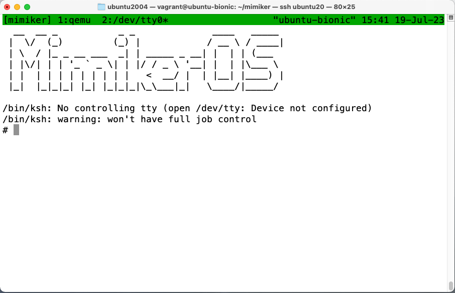

# Ubuntu 22.04にインストール

## llvmのインストール

```bash
$ mkdir -p ~/llvm-aarch64
$ git clone -b release/14.x --depth=1 https://github.com/llvm/llvm-project.git
$ cd llvm-project
$ cmake -S llvm -B build -G Ninja -DLLVM_ENABLE_PROJECTS='clang;clang-tools-extra;lld' -DCMAKE_INSTALL_PREFIX='/home/vagrant/llvm-aarch64' -DCMAKE_BUILD_TYPE=Release -DLLVM_USE_LINKER=lld -DLLVM_TARGETS_TO_BUILD='AArch64'
$ ninja -C build
$ ninja -C build install
```

## 依存ツールのインストール

```bash
$ sudo apt install --no-install-recommends git make ccache cpio curl gnupg universal-ctags cscope socat patch gperf quilt byacc python3 python3-pip python3-virtualenv device-tree-compiler tmux lsb-release
$ pip3 install -r requirements.txt
```

## Mimikerのインストール

```bash
$ git clone git@github.com:zuki/mimiker.git
$ cd mimiker
$ git checkout -b ubuntu
$ vi config.mk
$ vi build/tools.mk
```
## エラー対応

次の2つのエラーが発生したがいずれも対応できた。

### 1. riscv関連のファイルがコンパイル対象となりclangがriscv命令を認識できずエラー

```bash
[CC] sys/drv/clint.c -> sys/drv/clint.o
/home/vagrant/mimiker/sys/drv/clint.c:48:22: error: unrecognized instruction mnemonic
    uint64_t count = rdtime();
                     ^
/home/vagrant/mimiker/include/riscv/cpufunc.h:29:18: note: expanded from macro 'rdtime'
#define rdtime() csr_read64(time)
                ^
...
$ tail sys/drv/clint.c
static driver_t clint_driver = {
  .desc = "RISC-V CLINT driver",        // RISC-V専用のドライバ
```

- `config.mk`で｀CONFIG＿OPTS｀からMIPSとRISCVを外す

```diff
$ git diff config.mk
diff --git a/config.mk b/config.mk
index 5c5801c2..c6514460 100644
--- a/config.mk
+++ b/config.mk
@@ -4,7 +4,7 @@
 # build system for given platform.
 #

-CONFIG_OPTS := KASAN LOCKDEP KGPROF MIPS AARCH64 RISCV KCSAN
+CONFIG_OPTS := KASAN LOCKDEP KGPROF AARCH64 KCSAN

 BOARD ?= rpi3
```

### 2. リンカで未定義シンボルエラーが発生

```bash
make[2]: Leaving directory '/home/vagrant/mimiker/sys/tests'
[LD] Linking kernel image: mimiker.elf
ld.lld: error: undefined symbol: __aarch64_ldadd4_acq_rel
>>> referenced by refcnt.h:13 (/home/vagrant/mimiker/include/sys/refcnt.h:13)
>>>               evdev.o:(evdev_open) in archive drv/drv.ka
...
ld.lld: error: undefined symbol: __aarch64_swp4_acq_rel
ld.lld: error: undefined symbol: __aarch64_cas8_acq_rel
ld.lld: error: undefined symbol: __aarch64_ldset8_acq_rel
ld.lld: error: undefined symbol: __aarch64_swp8_acq_rel
ld.lld: error: undefined symbol: __aarch64_cas4_acq_rel
```

- これを回避するオプションを追加

```diff
$ git diff build/flags.mk
diff --git a/build/flags.mk b/build/flags.mk
index 024eade8..1e9b8584 100644
--- a/build/flags.mk
+++ b/build/flags.mk
@@ -6,5 +6,5 @@
 ASFLAGS  += -Wall -Wextra -Werror
 WFLAGS   += -Wall -Wextra -Wno-unused-parameter -Wstrict-prototypes -Werror \
            -Wno-missing-field-initializers
-CFLAGS   += -std=gnu11 -Og -ggdb3 -fomit-frame-pointer
+CFLAGS   += -std=gnu11 -Og -ggdb3 -fomit-frame-pointer -mno-outline-atomics
 CPPFLAGS += -DDEBUG
```

# 実行

```diff
$ git diff launch
diff --git a/launch b/launch
index 6c5dc406..8eb56f6c 100755
--- a/launch
+++ b/launch
@@ -122,7 +122,7 @@ CONFIG = {
                 'drive': 'if=none,id=stick,file={path}',
             },
             'rpi3': {
-                'binary': 'qemu-mimiker-aarch64',
+                'binary': 'qemu-system-aarch64',
                 'options': [
                     '-machine', 'raspi3b',
                     '-smp', '4',
$ ./launch
```



# テスト

```diff
@@ -183,7 +183,7 @@ CONFIG = {
                 'binary': 'mipsel-mimiker-elf-gdb'
             },
             'rpi3': {
-                'binary': 'aarch64-mimiker-elf-gdb'
+                'binary': 'gdb-multiarch'
             },
             'litex-riscv': {
                 'binary': 'riscv32-mimiker-elf-gdb'
```

```bash
$ ./run_tests.py --times=3
Testing seed 1690956003...
sys/dts/rpi3.dts:37.35-43.5: Warning (interrupt_provider): /soc@1/local_intc@40000000: Missing #address-cells in interrupt provider
sys/dts/rpi3.dts:45.23-52.5: Warning (interrupt_provider): /soc@1/intc@7e00b200: Missing #address-cells in interrupt provider
Testing seed 3518584114...
sys/dts/rpi3.dts:37.35-43.5: Warning (interrupt_provider): /soc@1/local_intc@40000000: Missing #address-cells in interrupt provider
sys/dts/rpi3.dts:45.23-52.5: Warning (interrupt_provider): /soc@1/intc@7e00b200: Missing #address-cells in interrupt provider
Testing seed 1799805246...
sys/dts/rpi3.dts:37.35-43.5: Warning (interrupt_provider): /soc@1/local_intc@40000000: Missing #address-cells in interrupt provider
sys/dts/rpi3.dts:45.23-52.5: Warning (interrupt_provider): /soc@1/intc@7e00b200: Missing #address-cells in interrupt provider
Tests successful!
``````
